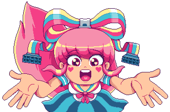

<p align="center">
  <a href="" rel="noopener">
  </a>
  
</p>
<h3 align="center">Assigment 1</h3>

<div align="center">

[]()
[](/LICENSE)
<br>


</div>

---

## 📝 Table of Contents

- [About](#about)
- [Getting Started](#getting_started)
- [Usage](#usage)
- [Authors](#authors)
- [Acknowledgments](#acknowledgement)

## 🧐 About <a name = "about"></a>

This is a alem foundation fourth self project. 
### Learning Objectives
- Html
- Semantic HTML
- CSS
- Page Content
- Accessibility
- Team Collaboration
- Validation
- Creativity and Effort
### Abstract
In this project, I created a website called `Kinda mess` to:

- Blablabla
- Bla bla bla
- Bla, bla bla

## 🏁 Getting Started <a name = "getting_started"></a>

These instructions will get you a copy of the project up and running on your local machine for development and testing purposes. 
### Prerequisites

What things you need to install the software and how to install them.

```
Any browser to view the page, 
for example Firefox, Edge, Chromium, etc.
```

### Installing

A step by step series of examples that tell you how to get a development env running.

Say what the step will be

```
git clone https://github.com/ExonegeS/WebAssigment1.git
```

### Resources

- Read about `html elements` [here](https://www.w3schools.com/html/)
- Read about [RGB color formats](https://en.wikipedia.org/wiki/List_of_monochrome_and_RGB_color_formats)

### General Instructions

- If an error occurs, the program must exit with non zero status code and display a clear and understandable error.
- I mean, it's just an web project, make sure it at least works, meh.

## 🔍 Usage

- wuh

## ✍️ Authors <a name = "authors"></a>

- [](https://github.com/ExonegeS)
- <a href="https://t.me/undefinedbro" target="_blank"></a>
- <a href="https://moodle.astanait.edu.kz/user/profile.php?id=12614" target="_blank"></a>


## 🎉 Acknowledgements <a name = "acknowledgement"></a>

- Thanks to <i><b>me</b></i>
- Additional thanks to <i><b>me</b></i>
- <i><b>Me</b></i> not a narcissist

